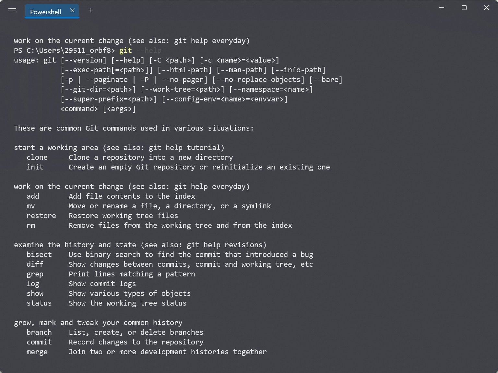
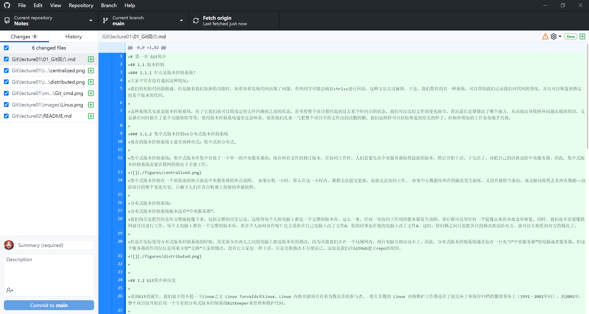

# 01_Git简介
## 1.1 版本控制
### 1.1.1 什么是版本控制系统？

#### 问题情境

大家平常有没有遇到这种情况：我们的初始代码能跑通，但是随着我们加新的功能时，加着加着发现代码出现了问题。有些同学可能会疯狂ctrl+z进行回退，这种方法太过麻烦。于是，我们想有没有一种系统，可以帮助我们记录我们对代码的变化，并且可以恢复到指定的某个版本的代码。

#### 解决方法

这种系统其实就是版本控制系统，有了它我们就可以将选定的文件回溯到之前的状态，甚至将整个项目都回退到过去某个时间点的状态，我们可以比较文件的变化细节，查出最后是谁修改了哪个地方，从而找出导致怪异问题出现的原因，又是谁在何时报告了某个功能缺陷等等。使用版本控制系统通常还意味着，就算我们乱来一气把整个项目中的文件改的改删的删，我们也照样可以轻松恢复到原先的样子。但额外增加的工作量却微乎其微。

#### 官方定义

**VCS 版本控制系统**（version control system），是一种记录一个或若干文件内容变化，以便将来查阅特定版本修订情况的系统。版本控制系统不仅可以应用于软件源代码的文本文件，而且可以对任何类型的文件进行版本控制。用的比较多的如 svn，git等。

参考链接：[VCS 版本控制系统](https://baike.baidu.com/item/VCS/16704169)

#### 为什么要学Git

- 代码备份
- 多人协作
- 以后工作的需要
- 提高开发效率

### 1.1.2 集中式版本控制vs分布式版本控制系统
现有的版本控制系统主要有两种形式：集中式和分布式。

#### CVCS 集中式版本控制系统

集中式版本库集中存放于一个单一的中央服务器的，保存所有文件的修订版本。在协同工作时，人们需要先从中央服务器取得最新的版本，然后开始干活，干完活了，再把自己的活推送给中央服务器。因此，集中式版本控制系统需要在联网的情况下才能工作。


缺点：中央服务器的单点故障问题。 如果宕机一小时，那么在这一小时内，谁都无法提交更新，也就无法协同工作。 如果中心数据库所在的磁盘发生损坏，又没有做恰当备份，将会丢失整个项目的历史更改记录，只剩下人们在各自机器上保留的单独快照。因此，分布式版本控制系统问世了（DVCS）。

#### DVCS分布式版本控制系统

在DVCS中，客户端不仅仅是只提取最新版本的文件快照，而是把代码仓库完整的镜像下来，包括完整的历史记录。所以每一次提取的操作，都是对代码仓库的完整备份，因此也就不必担心协同工作用的服务器发生故障。这么一来，任何一处协同工作用的服务器发生故障，事后都可以用任何一个镜像出来的本地仓库恢复。

在DVCS中，通常也有一台充当“中央服务器”的服务器（一般选择Github，Git 和Github 相当于球和球场的关系），这个服务器的作用可以用来方便“交换”大家的修改。


## 1.2 Git简介和历史

说到Git的诞生，我们就不得不提一下Linux之父 Linus Torvalds（1969年12月28日- ）和Linux。Linux 内核开源项目有着为数众多的参与者。 绝大多数的 Linux 内核维护工作都花在了提交补丁和保存归档的繁琐事务上（1991－2002年间）。到2002年，整个项目组开始启用一个专有的分布式版本控制系统BitKeeper来管理和维护代码。

但是到了2005年，开发BitKeeper的商业公司认为Linux开发者内部有人对BitKeeper内部使用的协议进行逆向工程，因此他们收回了 Linux 内核社区免费使用 BitKeeper 的权力。 这就迫使 Linux 开源社区（特别是 Linux 的缔造者 Linus Torvalds）基于使用 BitKeeper 时的经验教训，开发出自己的版本系统。 他们对新的系统制订了若干目标：

- 速度

- 简单的设计

- 对非线性开发模式的强力支持（允许成千上万个并行开发的分支）

- 完全分布式

- 有能力高效管理类似 Linux 内核一样的超大规模项目（速度和数据量）

于是在Linux之父Linus Torvalds的带领下用了10天编写出了第一个Git版本。自诞生以来，Git 日臻成熟完善，在高度易用的同时，仍然保留着初期设定的目标。 它的速度飞快，极其适合管理大项目，有着令人难以置信的非线性分支管理系统。

Linus 代表作品 [Linux](https://baike.baidu.com/item/Linux/27050)、[GIT](https://baike.baidu.com/item/GIT/12647237)，非常推崇开源学习（Open Source），必须来一张偶像帅气的照片


## 1.3 Git的安装
关于Git的安装，我们可以访问Git book所给的下载教程进行下载，我们在下面的几部分也是仅做简要叙述。参考链接 --> [安装 Git](https://git-scm.com/book/zh/v2/%E8%B5%B7%E6%AD%A5-%E5%AE%89%E8%A3%85-Git)
### 1.3.1 Linux
我们可以在terminal输入`git`命令查看系统有没有安装git。如果没有安装的话，我们可以访问git关于linux和unix的安装页面，输入对应的安装命令。网页链接 --> [Download for Linux and Unix](https://git-scm.com/download/linux)
```bash
# Git的安装命令
sudo apt-get install git
```
也可以在Windows安装Ubuntu子系统 
### 1.3.2 Windows
在 Windows 上安装 Git 也有几种安装方法。 我们也可以打开 https://git-scm.com/downloads  进行下载安装。安装好后我们可以打开cmd。


另一个简单的方法是安装 GitHub Desktop。 该安装程序包含图形化和命令行版本的 Git。 它也能支持 Powershell，提供了稳定的凭证缓存和健全的换行设置。



### 1.3.3 macOS
在 Mac 上安装 Git 有多种方式。 最简单的方法是安装 Xcode Command Line Tools。 Mavericks （10.9） 或更高版本的系统中，在 Terminal 里尝试首次运行 git 命令即可。
```bash
git --version
```
如果没有我们安装过命令行开发者工具，terminal也会提示你安装。

如果我们想安装更新的版本，可以使用二进制安装程序。 官方维护的 macOS Git 安装程序可以在 Git 官方网站下载，网址为 https://git-scm.com/download/mac。

## 1.4 其它相关软件

**GitHub **是一个面向开源及私有软件项目的托管平台，因为只支持Git作为唯一的版本库格式进行托管，故名GitHub。

**GitLab** 是一个用于仓库管理系统的开源项目，使用Git作为代码管理工具，并在此基础上搭建起来的Web服务。

**Gitee** 是开源中国（OSChina）推出的基于Git的代码托管服务。

**SVN** 是subversion的缩写，是一个开放源代码的版本控制系统，通过采用分支管理系统的高效管理，简而言之就是用于多个人共同开发同一个项目，实现共享资源，实现最终集中式的管理。

**Git和Github的区别**：总结来说，Git是个版本控制的工具，能够帮你更好的写程序，用来管理本地的代码工程，它可以记录代码内容的变更；而Github是一个代码托管平台，我们可以使用Git将本地代码上传到Github，也可以帮助程序员之间互相交流和学习。