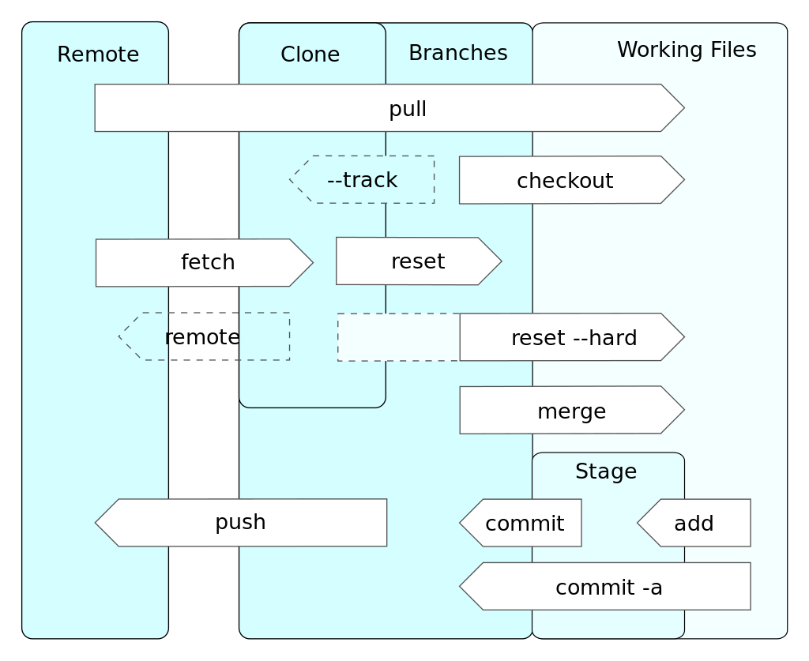
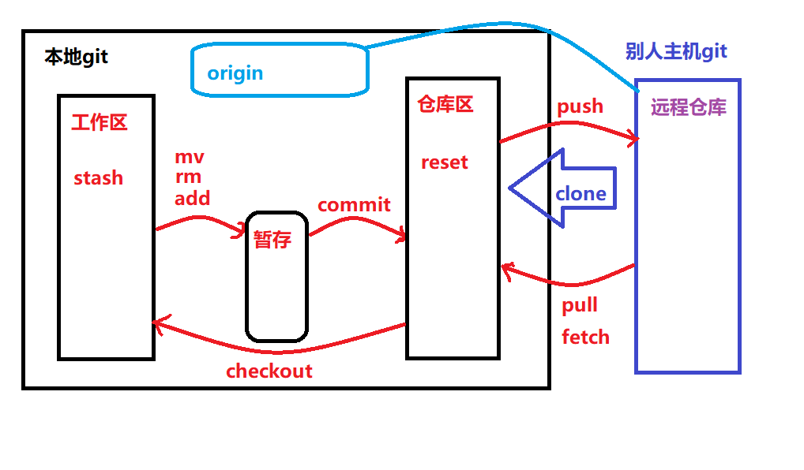

# 02_Git基础命令

[TOC]

## 2.0 前言
因个人在日常办公中使用Github Desktop，都是点点点的操作，对一些原始的Git命令有些生疏，特此来复习复习。

Git 支持多种数据传输协议。 https:// 协议，git:// 协议，SSH 协议

- 配置并初始化一个仓库（repository）
- 开始或停止跟踪（track）文件
- 暂存（stage）或提交（commit）更改
- 配置 Git 来忽略指定的文件和文件模式
- 撤销错误操作
- 浏览项目的历史版本以及不同提交（commits）之间的差异
- 向远程仓库推送（push）文件
- 从远程仓库拉取（pull）文件

### 先聊聊Git设计



Git 是一个分布式的版本控制工具，因此远程和本地可以视为两个独立的 Git 仓库。上图（来自维基百科）是一张经典的 Git 中的数据流与存储级别的介绍，其中储存级别主要包含几部分：

- 工作区 (Working Files)，指的是我们时刻在编辑的文件的目录，通常来说我们修改文件都是在工作区体现的
- 暂存区（Stage），暂存将本地的修改，然后提交到本地仓库
- 本地仓库（Local）
- 远程仓库（Remote）

由此不难看出整体的数据流动，就是一条从：**工作区 -> 暂存区 -> 本地仓库 -> 远程仓库** 的双向数据流通道。





## 2.1 获取 Git 仓库的方式

### 2.1.1 本地目录转为 Git 仓库

```shell 
# 进入到对应的项目目录里（在已存在目录中初始化仓库）
git init
```

```shell
# 追踪这些文件并进行初始提交
git add *.py
git commit -m 'initial project version'
```

### 2.1.2 克隆远程仓库

```shell
# 执行 git clone 命令的时候，所有文件的所有版本都将被拉取下来
git clone https://github.com/libgit2/libgit2

# 自定义本地仓库的名字
git clone https://github.com/libgit2/libgit2 mylibgit
```


## 2.2 记录每次更新到仓库

Git仓库文件的两种状态：**已跟踪 或 未跟踪**

已跟踪的文件的三种状态：**未修改，已修改或已放入暂存区**

初次克隆某个仓库的时候，工作目录中的所有文件都属于已跟踪文件，并处于未修改状态。 编辑过某些文件之后，由于自上次提交后你对它们做了修改，Git 将它们标记为已修改文件。 在工作时，你可以选择性地将这些修改过的文件放入暂存区，然后提交所有已暂存的修改，如此反复。

### 2.2.0 文件的状态变化周期图


### 2.2.1 检查当前文件状态
```shell
# 检查当前文件状态
git status

# 向README.md文件写入'hello'
echo 'hello' > README.md

# 再次查看状态时，提示我们有新的未跟踪文件，可使用git add添加追踪
git status
On branch master
No commits yet
Untracked files:
  (use "git add <file>..." to include in what will be committed)
        README.md
nothing added to commit but untracked files present (use "git add" to track)

# 状态简览
git status 命令的输出十分详细，但其用语有些繁琐。
git status -s 或 git status --short ，输出的格式为紧凑型
```


### 2.2.2 跟踪新文件

```shell
# 使用git add <file>添加追踪
git add README.md

# 此时再运行 git status 命令，会看到README.md文件已被跟踪，并处于暂存状态
git status
On branch master
No commits yet
Changes to be committed:
  (use "git rm --cached <file>..." to unstage)
        new file:   README.md

# git add 命令 使用文件或目录的路径作为参数，如果参数是目录的路径，将跟踪该目录下的所有文件。
```


###  2.2.3 暂存已修改的文件

```shell
# 修改一个已被跟踪的文件 状态有M，内容发生了变化，需要重新运行 git add CONTRIBUTING.md
git status -s
AM CONTRIBUTING.md
A  README.md

# git add 可以用它开始跟踪新文件，或者把已跟踪的文件放到暂存区，还能用于合并时把有冲突的文件标记为已解决状态等
# 将这个命令理解为 “精确地将内容添加到下一次提交中” 而不是 “将一个文件添加到项目中” 要更加合适
```
```shell
# 重新运行 git add CONTRIBUTING.md，将其放到暂存区
git add CONTRIBUTING.md
git status -s
A  CONTRIBUTING.md
A  README.md

# 现在两个文件都已暂存，下次提交时就会一并记录到仓库
```
```shell
# 新添加的未跟踪文件前面有 ?? 标记
# 修改过的文件前面有 M 标记
# 添加到暂存区中的文件前面有 A 标记
git status -s
A  CONTRIBUTING.md
A  README.md
?? LICENSE.txt
```


###  2.2.4 忽略文件

```shell
# 查看仓库的 .gitignore 文件
cat .gitignore
*.[oa]  # 忽略所有以 .o 或 .a 结尾的文件
*~  # 忽略所有名字以波浪符（~）结尾的文件

# 忽略所有的 .a 文件
*.a

# 只忽略当前目录下的 TODO 文件，而不忽略 subdir/TODO
/TODO

# 忽略任何目录下名为 build 的文件夹
build/

# 忽略 doc/notes.txt，但不忽略 doc/server/arch.txt
doc/*.txt

# 忽略 doc/ 目录及其所有子目录下的 .pdf 文件
doc/**/*.pdf

# 注意：在根目录和子目录都可以有 .gitignore 文件
# 详细文档：https://github.com/github/gitignore
```
```shell
# 文件 .gitignore 的格式规范如下：

所有空行或者以'#'开头的行都会被 Git 忽略
匹配模式可以以（/）开头防止递归
匹配模式可以以（/）结尾指定目录
要忽略指定模式以外的文件或目录，可以在模式前加上叹号（!）取反

可以使用标准的 glob 模式匹配，它会递归地应用在整个工作区中
星号（*）匹配零个或多个任意字符；
[abc] 匹配任何一个列在方括号中的字符；
问号（?）只匹配一个任意字符；
如果在方括号中使用短划线分隔两个字符，表示所有在这两个字符范围内的都可以匹配（比如 [0-9] 表示匹配所有0到9的数字）
```


###  2.2.5 查看已/未暂存暂存的修改
```shell
# 显示哪些行发生了改变
git diff
```


###  2.2.6 提交更新
```shell
# 启动你选择的文本编辑器来输入提交说明
git commit
# 注意：提交时记录的是放在暂存区域的快照。
# 任何还未暂存文件的仍然保持已修改状态，可以在下次提交时纳入版本管理。
# 每一次运行提交操作，都是对你项目作一次快照，以后可以回到这个状态，或者进行比较。
```


###  2.2.7 跳过使用暂存区域

```shell
# 使用暂存区域略显繁琐，加上 -a 选项，跳过使用暂存区域
git commit -a -m 'added new benchmarks'
```


###  2.2.8 移除文件

```shell
# 从暂存区域移除，再从工作目录中删除
git rm README.md
rm 'README.md'

# 删除之前修改过或已经放到暂存区的文件 加-f

# 从 Git 仓库中删除/从暂存区域移除 使用 --cached 选项
git rm --cached README

# 删除 log/ 目录下扩展名为 .log 的所有文件
git rm log/\*.log

# 删除所有名字以 ~ 结尾的文件
git rm \*~
```


###  2.2.9 移动文件/更名

```shell
# git mv <path 文件的当前路径> <target_path 文件的目标路径>
# 命令可以将一个文件或者目录移动到另一处，或者实现更名
git mv README.md README
```


## 2.3 查看提交历史

```shell
# 查看提交历史
git log

#  -p 或 --patch 显示每次提交所引入的差异; -2 选项来只显示最近的两次提交
git log -p -2

# --stat 选项：提交的简略统计信息
git log --stat
```


## 2.4 撤消操作

```shell
# 修改最后一次提交
git commit --amend

# 取消暂存的文件
git reset HEAD CONTRIBUTING.md

# 撤消对文件的修改
git checkout -- CONTRIBUTING.md
# 注意：git checkout -- <file> 是一个危险的命令，你对那个文件在本地的任何修改都会消失，会用最近提交的版本覆盖掉它
```


------


## 2.5 远程仓库的使用

远程仓库的特点：

- 托管在网络中的你的项目的版本库
- 可以有多个远程仓库
- 通常有些仓库对你只读，有些则可以读写
- 与他人协作涉及管理远程仓库 以及 根据需要推送或拉取数据

管理远程仓库包括：

- 了解如何添加远程仓库
- 移除无效的远程仓库
- 管理不同的远程分支


### 2.5.1 远程仓库的各种操作

```shell
git clone 命令会自动设置本地 master(主) 分支跟踪克隆的远程仓库的 master 分支（或其它名字的默认分支）
git pull 通常会从最初克隆的服务器上抓取数据并自动尝试合并到当前所在的分支

# clone下来远程库，进入到目录执行

# 1.查看远程仓库
# 查看远程库的信息 默认名字origin
git remote
origin

# 查看远程库的详细信息  2951121599与协作者xyz合作的远程库
git remote -v
xyz     git@github.com:xyz/test_git.git (fetch)
xyz     git@github.com:xyz/test_git.git (push)
origin  git@github.com:2951121599/test_git.git (fetch)
origin  git@github.com:2951121599/test_git.git (push)

# 查看远程仓库的更多详细信息
git remote show <remote>

# 2.添加远程仓库
# git remote add <shortname> <url> 添加一个新的远程 Git 仓库
git remote add tg git@github.com:2951121599/test_git.git
git remote -v
origin  git@github.com:2951121599/test_git.git (fetch)
origin  git@github.com:2951121599/test_git.git (push)
tg      git@github.com:2951121599/test_git.git (fetch)
tg      git@github.com:2951121599/test_git.git (push)

# 3.推送到远程仓库分支
# git push <remote> <branch> 将 master 分支推送到 origin 服务器时；克隆时通常会自动帮你设置好那两个名字
git push origin master
# 注意：只有当你有所克隆服务器的写入权限，并且之前没有人推送过时，这条命令才能生效。 当你和其他人在同一时间克隆，他们先推送到上游然后你再推送到上游，你的推送就会毫无疑问地被拒绝。 你必须先抓取他们的工作并将其合并进你的工作后才能推送。即先pull后push

# 4.远程仓库重命名
git remote rename <old_name> <new_name>

# 5.删除远程仓库
git remote rm <origin>
```


### 2.5.2 更新代码时 fetch和pull区别

```shell
`git fetch` + `git merge` = `git pull`

`git fetch` 只从远程拉最新的代码，并修改本地缓存的远程分支的commitID
`git fetch` 之后使用 `git status` 就会看到本地分支落后远程分支这种提示

`git pull` 会做 `git fetch` 同样的工作，此外还会将远程分支直接合并到本地分支
```


## 2.6 打标签-tag

Git 可以给仓库历史中的某一个提交打上标签，以示重要。 比较有代表性的是人们会使用这个功能来标记发布结点（ v1.0 、 v2.0）

```shell
# 1.创建tag（轻量标签（lightweight）与附注标签（annotated））
git tag -a v1.1.0 -m ""

# 2.查看tag
git tag

# 3.推送到远程
git push origin --tags

# 4.删除本地tag
# git tag -d <tagname>
git tag -d v1.0.0

# 5.删除远程tag
# git push <remote> :refs/tags/<tagname> 或者 git push origin --delete <tagname>
git push origin :refs/tags/v1.0.0
```


## 2.7 Git 命令替换为别名

```shell
# 通过 git config 文件为每一个命令设置一个别名

# 撤消对文件的修改 git co
git config --global alias.co checkout

# 查看所有分支 git br
git config --global alias.br branch

# 提交更新 git ci
git config --global alias.ci commit

# 查看文件状态 git st
git config --global alias.st status

# 取消暂存文件 git unstage
git config --global alias.unstage 'reset HEAD --'

# 查看最后一次提交 git last
git config --global alias.last 'log -1 HEAD'
```
