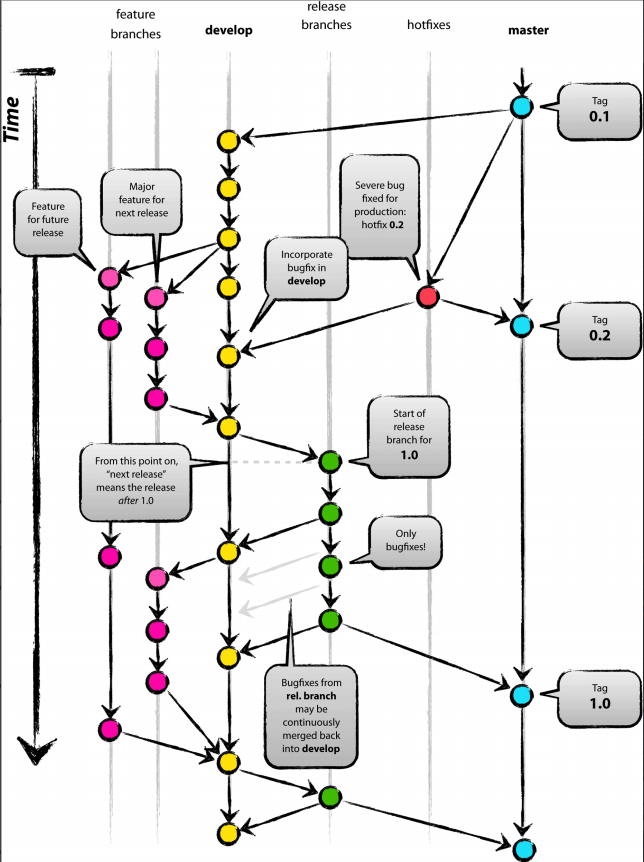

# 04_GitFlow工作流实战

[TOC]

## 4.0 引言

在实际项目开发工作中，常常会有自测、联调、提测、线上紧急修复等多工作环节，对应可能需要本地、内测、开发、测试、生产等多环境部署代码的需求，对应每个环节会产生不同的分支；

本⽂将从Git-Flow模型原理出发，通过命令行演示实际可操作⼿段并进⾏总结，最终希望Git-Flow在实际项⽬中应⽤起来，从⽽⾼效完成代码开发、版本管理等实际⼯作。

（注：不同的公司或者不同的项目的GitFlow工作流模型标准也不同，具体以实际应用为准；本文提供的为常用模板，较为全面和通用，建议多加练习，达到熟练掌握的程度）


## 4.1 深⼊理解Git-Flow⼯作流模型原理

- Git-Flow模型解决什么问题? 

  为了解决实际项⽬中代码开发、代码测试、bug修复、版本发布等⼀系过程列严重耦合从⽽产⽣各种问题，如冲突过度、版本混乱。

- Git-Flow模型⼜是如何解决上述问题的呢? 

  基于Git定义5种类型的分⽀，各分⽀严格定义其指责、起⽌点等，从⽽使开发、测试、发版等过程有条不紊进⾏。


### 4.1.1 Git-Flow流程图：

该流程图完整描述Git-Flow模型处理过程，当我们深⼊理解各分⽀，然后结合项⽬阶段与⾃身的⻆⾊（开发/测试/项⽬经理），就会发现每个角色在某个阶段需要关注的可能也就⼀两个分⽀，⽐如在开发阶段，开发⼈员只需关注⾃⼰的新功能分⽀（Feature分支）；release阶段，测试⼈员和开发⼈员都只需关注Release分⽀，各⾃的职责有所差异⽽已




### 4.1.2 Git-Flow各分⽀的说明 

|           分⽀名称           | 作⽤                                  | ⽣命周期               | 提交or合并                                                   | 起⽌点                                               |
| :--------------------------: | ------------------------------------- | ---------------------- | ------------------------------------------------------------ | ---------------------------------------------------- |
|         Feature分⽀          | ⽤于某个功能                          | 临时分⽀、开发阶段     | 可提交代码                                                   | 由Develop分⽀产⽣，最终合并到Develop分⽀             |
|         Develop分⽀          | 记录历史开发功能                      | 贯穿整个项⽬           | 不能提交，由Feature分⽀、Bugfix分⽀、Release分⽀、Hotfix分⽀合并代码 | 整个项⽬                                             |
|         Release分⽀          | ⽤于本次Release 如⽂档、测试、bug修复 | 临时分⽀、发版阶段     | 可提交代码                                                   | 由Develop分⽀产⽣，最终合并到Develop分⽀和Master分支 |
|    Hotfix（修补程序）分⽀    | ⽤于解决线上bug                       | 临时分⽀、紧急修复阶段 | 可提交代码                                                   | 由master分⽀产⽣，最终合并到Develop分⽀和Master分支  |
| Master（Production生产）分⽀ | 记录历史发布版本                      | 贯穿整个 项⽬          | 不能提交，由Release、Hotfix分⽀合并代码                      | 整个项⽬                                             |


### 4.1.3 不同⻆度理解各分⽀ 

- ⽣命周期 

  Master分⽀和Develop分⽀贯穿项⽬；其他分⽀均为承担特定指责的临时分⽀。 

- 项⽬阶段 

  开发阶段 主要涉及Feature分⽀、Develop分⽀

  发布阶段 主要涉及Release分⽀、Production分⽀、Develop分⽀

  紧急修复阶段 主要涉及Hotfix分⽀、Production分⽀、Develop分⽀

- 成员关注点 

  开发⼈员 关注 Develop分⽀、Feature分⽀以及特殊阶段关注Hotfix、Release分⽀的bug修复
  
  测试⼈员 关注 Release分⽀、Hotfix分⽀的功能测试
  
  项⽬经理 关注 Production分⽀、Release分⽀

另外要说明，项⽬阶段在时间纬度有可能重叠。⽐如：Release阶段（当前版本）与下各版本的开发阶段可同时存在，因为当前Release阶段的发起同时也就意味着下⼀个Release的开发阶段的开始；⼀旦线上出现bug(任何时候都可能出现)，紧急修复阶段就可能与开发阶段、发版阶段重叠。因此，要求团队成员都要理解Git-Flow⼯作流，以及⾃身所处的项⽬阶段。


## 4.2 命令行演示⼀个完整的Git-Flow流程 

实践⼀个从功能开发到版本发布的完整的流程，感受⼀下Git-Flow的具体操作。

> 特此说明，以下shell命令是在win10环境下，'D:\Github_Repository\GitFlow' 目录，使用git bash工具进行演示；‘\$’ 符号所在行为演示命令，如有内容输出，会在‘\$’ 符号所在行的下面输出。

### 4.2.1 初始化项⽬，创建Develop分⽀

```shell
D:\Github_Repository\GitFlow

$ mkdir gitflow_demo

29511@Taylor MINGW64 /d/Github_Repository/GitFlow
$ cd gitflow_demo/

29511@Taylor MINGW64 /d/Github_Repository/GitFlow/gitflow_demo
$ touch readme.md

29511@Taylor MINGW64 /d/Github_Repository/GitFlow/gitflow_demo
$ git init
Initialized empty Git repository in D:/Github_Repository/GitFlow/gitflow_demo/.git/

29511@Taylor MINGW64 /d/Github_Repository/GitFlow/gitflow_demo (master)
$ git add .

29511@Taylor MINGW64 /d/Github_Repository/GitFlow/gitflow_demo (master)
$ git commit -m "init"
[master (root-commit) 6d91faf] init
 1 file changed, 0 insertions(+), 0 deletions(-)
 create mode 100644 readme.md

29511@Taylor MINGW64 /d/Github_Repository/GitFlow/gitflow_demo (master)
$ git checkout -b develop master
Switched to a new branch 'develop'
```


### 4.2.2 模拟开发阶段过程

创建新功能Feature分⽀、实现⼀个⽤户登录模块、然后合并到Develop分⽀、删除功能分⽀

```shell
# 创建并切换到feature-login分支
29511@Taylor MINGW64 /d/Github_Repository/GitFlow/gitflow_demo (develop)
$ git checkout -b feature-login develop
Switched to a new branch 'feature-login'

# 添加LoginUser.html文件，并commit
29511@Taylor MINGW64 /d/Github_Repository/GitFlow/gitflow_demo (feature-login)
$ touch LoginUser.html

29511@Taylor MINGW64 /d/Github_Repository/GitFlow/gitflow_demo (feature-login)
$ echo "hi, this is user html" > LoginUser.html

29511@Taylor MINGW64 /d/Github_Repository/GitFlow/gitflow_demo (feature-login)
$ git add .
warning: LF will be replaced by CRLF in LoginUser.html.
The file will have its original line endings in your working directory

29511@Taylor MINGW64 /d/Github_Repository/GitFlow/gitflow_demo (feature-login)
$ git commit -m "feature: add LoginUser.html"
[feature-login 23b62f0] feature: add LoginUser.html
 1 file changed, 1 insertion(+)
 create mode 100644 LoginUser.html

# 添加LoginUser.js文件，并commit
29511@Taylor MINGW64 /d/Github_Repository/GitFlow/gitflow_demo (feature-login)
$ touch LoginUser.js

29511@Taylor MINGW64 /d/Github_Repository/GitFlow/gitflow_demo (feature-login)
$ echo "hi, this is user js" > LoginUser.js

29511@Taylor MINGW64 /d/Github_Repository/GitFlow/gitflow_demo (feature-login)
$ git add .
warning: LF will be replaced by CRLF in LoginUser.js.
The file will have its original line endings in your working directory

29511@Taylor MINGW64 /d/Github_Repository/GitFlow/gitflow_demo (feature-login)
$ git commit -m "feature: add LoginUser.js"
[feature-login 9175e4d] feature: add LoginUser.js
 1 file changed, 1 insertion(+)
 create mode 100644 LoginUser.js

# 切换到develop分支，将feature-login分支合并后删除
29511@Taylor MINGW64 /d/Github_Repository/GitFlow/gitflow_demo (feature-login)
$ git status
On branch feature-login
nothing to commit, working tree clean

29511@Taylor MINGW64 /d/Github_Repository/GitFlow/gitflow_demo (feature-login)
$ git checkout 'develop'
Switched to branch 'develop'

29511@Taylor MINGW64 /d/Github_Repository/GitFlow/gitflow_demo (develop)
$ git merge --no-ff feature-login
Merge made by the 'ort' strategy.
 LoginUser.html | 1 +
 LoginUser.js   | 1 +
 2 files changed, 2 insertions(+)
 create mode 100644 LoginUser.html
 create mode 100644 LoginUser.js

29511@Taylor MINGW64 /d/Github_Repository/GitFlow/gitflow_demo (develop)
$ git branch -d feature-login
Deleted branch feature-login (was 9175e4d).
```


### 4.2.3 模拟Release阶段过程

创建Release分⽀、进⾏bug修复、合并到Production分⽀与Develop分⽀

```shell
# 创建并切换到release-v0.1分支
29511@Taylor MINGW64 /d/Github_Repository/GitFlow/gitflow_demo (develop)
$ git checkout -b release-v0.1 develop
Switched to a new branch 'release-v0.1'

# 进行bug修复并提交commit
29511@Taylor MINGW64 /d/Github_Repository/GitFlow/gitflow_demo (release-v0.1)
$ echo "bugfix LoginUser.html" >> LoginUser.html

29511@Taylor MINGW64 /d/Github_Repository/GitFlow/gitflow_demo (release-v0.1)
$ git add .
warning: LF will be replaced by CRLF in LoginUser.html.
The file will have its original line endings in your working directory

29511@Taylor MINGW64 /d/Github_Repository/GitFlow/gitflow_demo (release-v0.1)
$ git commit -m "fix: bugfix for LoginUser.html"
[release-v0.1 cce8e38] fix: bugfix for LoginUser.html
 1 file changed, 1 insertion(+)

# 将release-v0.1分支合并到master分支
29511@Taylor MINGW64 /d/Github_Repository/GitFlow/gitflow_demo (release-v0.1)
$ git checkout master
Switched to branch 'master'

29511@Taylor MINGW64 /d/Github_Repository/GitFlow/gitflow_demo (master)
$ git merge --no-ff release-v0.1
Merge made by the 'ort' strategy.
 LoginUser.html | 2 ++
 LoginUser.js   | 1 +
 2 files changed, 3 insertions(+)
 create mode 100644 LoginUser.html
 create mode 100644 LoginUser.js

# 打标签v0.1版本
29511@Taylor MINGW64 /d/Github_Repository/GitFlow/gitflow_demo (master)
$ git tag v0.1

# 将release-v0.1分支合并到develop分支并删除
29511@Taylor MINGW64 /d/Github_Repository/GitFlow/gitflow_demo (master)
$ git checkout develop
Switched to branch 'develop'

29511@Taylor MINGW64 /d/Github_Repository/GitFlow/gitflow_demo (develop)
$ git merge --no-ff release-v0.1
Merge made by the 'ort' strategy.
 LoginUser.html | 1 +
 1 file changed, 1 insertion(+)

29511@Taylor MINGW64 /d/Github_Repository/GitFlow/gitflow_demo (develop)
$ git branch -d release-v0.1
Deleted branch release-v0.1 (was cce8e38).

```


### 4.2.4 模拟线上故障，创建Hotfix分⽀

创建Hotfix分⽀、进⾏bug修复、合并到Production分⽀与Develop分⽀

```shell
# 创建并切换到hotfix-v0.1.1分支
29511@Taylor MINGW64 /d/Github_Repository/GitFlow/gitflow_demo (develop)
$ git checkout -b hotfix-v0.1.1 master
Switched to a new branch 'hotfix-v0.1.1'

# 在hotfix-v0.1.1分支上进⾏bug修复并提交
29511@Taylor MINGW64 /d/Github_Repository/GitFlow/gitflow_demo (hotfix-v0.1.1)
$ git status
On branch hotfix-v0.1.1
nothing to commit, working tree clean

29511@Taylor MINGW64 /d/Github_Repository/GitFlow/gitflow_demo (hotfix-v0.1.1)
$ echo "hotfix-v0.1.1 for LoginUser.html" >> LoginUser.html

29511@Taylor MINGW64 /d/Github_Repository/GitFlow/gitflow_demo (hotfix-v0.1.1)
$ cat LoginUser.html
hi, this is user html
bugfix LoginUser.html
hotfix for LoginUser.html

29511@Taylor MINGW64 /d/Github_Repository/GitFlow/gitflow_demo (hotfix-v0.1.1)
$ git add .
warning: LF will be replaced by CRLF in LoginUser.html.
The file will have its original line endings in your working directory

29511@Taylor MINGW64 /d/Github_Repository/GitFlow/gitflow_demo (hotfix-v0.1.1)
$ git commit -m "hotfix：hotfix for LoginUser.html"
[hotfix-v0.0.1 2f7470b] hotfix：hotfix for LoginUser.html
 1 file changed, 1 insertion(+)

# 将hotfix-v0.1.1分支合并到master分⽀
29511@Taylor MINGW64 /d/Github_Repository/GitFlow/gitflow_demo (hotfix-v0.1.1)
$ git checkout master
Switched to branch 'master'

29511@Taylor MINGW64 /d/Github_Repository/GitFlow/gitflow_demo (master)
$ git merge --no-ff hotfix-v0.1.1
Merge made by the 'ort' strategy.
 LoginUser.html | 1 +
 1 file changed, 1 insertion(+)

# 打标签
29511@Taylor MINGW64 /d/Github_Repository/GitFlow/gitflow_demo (master)
$ git tag v0.1.1

# 将hotfix-v0.1.1分支合并到develop分⽀
29511@Taylor MINGW64 /d/Github_Repository/GitFlow/gitflow_demo (master)
$ git checkout develop
Switched to branch 'develop'

29511@Taylor MINGW64 /d/Github_Repository/GitFlow/gitflow_demo (develop)
$ git merge --no-ff hotfix-v0.1.1
Merge made by the 'ort' strategy.
 LoginUser.html | 1 +
 1 file changed, 1 insertion(+)

# 删除hotfix-v0.1.1分支
29511@Taylor MINGW64 /d/Github_Repository/GitFlow/gitflow_demo (develop)
$ git branch -d hotfix-v0.1.1
Deleted branch hotfix-v0.1.1 (was 2f7470b).
```


