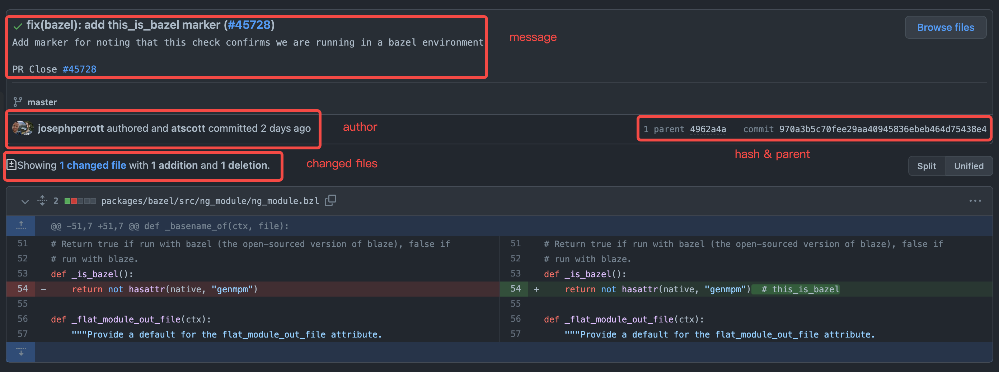
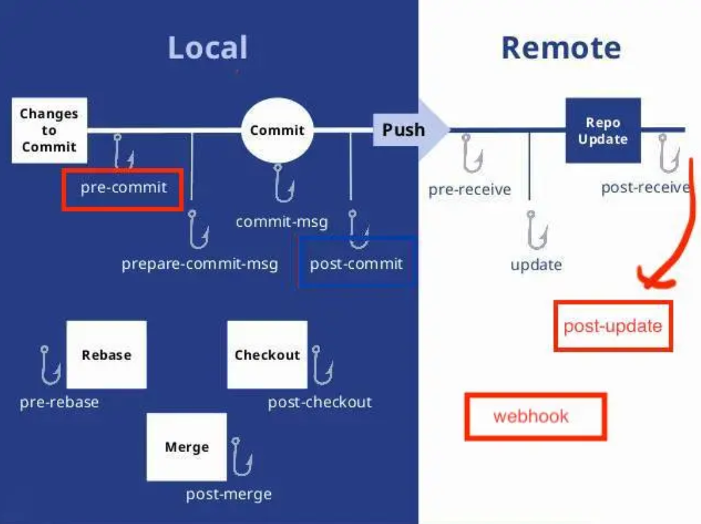

## 06_Git提交规范

[TOC]

### 6.1 commit 包含的信息

如下图所示（截取自Angular commit [970a3b5](https://github.com/angular/angular/commit/970a3b5c70fee29aa40945836ebeb464d75438e4)），一个commit包含如下几个信息：

* commit message - 提交的内容相关描述
* author & committer - 作者及提交者
* changed files - 修改的文件
* hash & parent - 提交内容的hash及在提交树上的位置




### 6.2 Commit Message

提交消息描述的是**当前提交的功能相关信息**，一般可以包括`header`，`body`，`footer`

```markdown
<header>
<BLANK LINE>
<body>
<BLANK LINE>
<footer>
```


#### header

```markdown
<type>(<scope>): <short summary>
  │       │             │
  │       │             └─⫸ 现在时态的摘要，不要大写，结尾没有句号。
  │       │
  │       └─⫸ common|compiler|compiler-cli|core...
  │
  └─⫸ Commit Type: build|ci|docs|feat|fix|perf|refactor|test
```

`<header>`中，`<type>`与`<summary>`是必须的，`<scope>`可以选填。建议`<header>`需要保持在50个字符之内。

`<type>`表明本次提交的类型，一般有如下几种：

* `build`: 涉及构建相关的改动
* `ci`: 持续集成相关的改动
* `docs`: 文档
* `feat`: 新功能
* `fix`: bug修复
* `perf`: 性能相关改动
* `refactor`: 重构相关（非bug、非新功能）
* `test`: 测试相关，包括新增测试或者更改已有测试

`<scope>`表示改动影响的范围。在Angular中，某个提交可能涉及的范围有表单处理、动画处理等。

`<summary>`则是对本次提交的简要描述


#### body

`<body>`是提交信息的更为详细的描述。

描述本次修改的动机，比如为什么引入本次改动，之前的逻辑是什么，现在的逻辑是什么，本次改动有哪些影响，等等。


#### footer

`<footer>`是可选项，一般涉及破坏性改动、功能的弃用等说明，以及对`GitHub issue`的引用，PR的引用等。

```markdown
BREAKING CHANGE: <breaking change summary>
<BLANK LINE>
<breaking change description + migration instructions(迁移指令)>
<BLANK LINE>
<BLANK LINE>
Fixes #<issue number>
```

```markdown
DEPRECATED: <what is deprecated(弃用了什么)>
<BLANK LINE>
<deprecation description + recommended update path(重大更改描述+迁移说明)>
<BLANK LINE>
<BLANK LINE>
Closes #<pr number>
```

规范的提交信息可以使用工具对内容进行解析，自动化生成文档或者发布日志。

在一些大型的开源项目中，版本的更新文档，接口的更新及兼容性影响，纯粹靠人工整理是很费时费力的，用统一的规范能够极大自动化这部分工作。

当然不同的项目对提交信息的要求和格式标准也不一样，开源项目或者公司项目对提交信息的要求也有差异，一般需要遵从所在项目的约定。较为成熟的开源项目一般可以在`README`文档中找到如何贡献，或者有单独的`CONTRIBUTING.md`文档，对代码风格、提交方式等进行约定。


### 6.3 Git Hooks

Git Hooks 就是git在特定的重要动作发生时触发自定义脚本。

Hooks 都被存储在 Git 目录下的 hooks 子目录中。 也即绝大部分项目中的 .git/hooks 。 当初始化一个新版本库时，Git 默认会在这个目录中放置一些示例脚本。这些示例的名字都是以 .sample 结尾，如果你想启用它们，得先移除这个后缀。



Git 含有两种类型的钩子：客户端的和服务器端的。

和自动化部署有关的钩子有两个，post-update 和 github基于post-update封装的webhook

涉及提交相关的是下面四个：

> pre-commit：在Git生成commit对象前执行
> prepare-commit-msg：在pre-commit后执行，用以生成默认的提交信息
> commit-msg：在开发者编写提交信息后执行，仅有临时文件名一个参数
> post-commit：在commit-msg后立马执行，更多做通知用

因此我们可以使用Git提供的`Git Hooks`功能对提交的信息进行自动校验，确保开发者对规范进行遵守。

我们可以用`prepare-commit-msg`对提交信息规范做说明，并用`commit-msg`对规范的执行进行检查，脚本的非0的返回会中断本次提交。

想使用相关的`Git Hooks`，可以在目录`.git/hooks`创建对应的文件，文件名为`prepare-commit-msg`及`commit-msg`，并赋予可执行权限。这样在我们进行`git commit`操作时，对应的脚本就会执行。

Git的提交不会包含`.git`目录，所以对应的`hooks`的改动并不会被提交到仓库中。我们可以在仓库根目录创建`.githooks`文件夹并将我们实现的代码放到该目录中，通过更改配置或者软连接的方式进行引用：

```shell
# use config
git config core.hooksPath .githooks
# or use soft link
ln -sf .githooks/* .git/hooks
```


### 6.4 Author & Committer

Git中，Author表示原始纂写该提交的作者，Committer表示应用该提交的人，如合并`Pull Request`的项目管理员。如果是个人开发者或只使用单个Git平台服务（如GitHub、BitBucket等），我们一般不需要对作者进行特别的配置。但如果使用多个Git平台或者有公司内部要求，我们可能需要针对不同的仓库设置不同的用户及邮箱，比如全局可以设置个人的GitHub账号，企业内部仓库设置企业邮箱等。

```shell
# 全局默认配置
git config --global user.email "<github email>"
git config --global user.name "<github username>"

# 企业内部仓库
git config user.email "<enterprise email>"
git config user.name "<real name>"
```


### 6.5 Changed files

不同的提交涉及的文件可多可少，一般遵循以下一些原则：

* 提交前使用`git diff`查看文件的改动，使用`git add`添加期望进入提交的文件，使用`git status`查看文件状态，最终使用`git commit`进行提交
* 单次提交仅提交相关的改动，例如修复两个不同的bug应该使用两次独立的提交
* 鼓励经常性的提交，这样可以更快的分享实现的功能，并且减少代码丢失的风险
* 在主分支或者协作的功能分支不能提交半成品，提交之前需要通过测试
* 编译输出，日志，中间产物等，不要引入到提交中，使用`.gitignore`进行相关文件的排除
* 密码、授权凭证、密钥等不要提交。
* 对于配置文件（如数据库连接信息等），一般使用配置模板，个人维护本地文件，且该文件在`.gitignore`中配置。


### 6.6 Hash & Parent

一般情况，`commit hash`及父节点信息我们不需要额外关注，但在特定场景下我们可能需要对`commit`进行修复或者其他处理。在这样的场景下，我们需要理解整个git的提交链，每个提交对应的父节点，分支间的共同祖先，以及本地与远端的差异，同时我们需要在整个提交中遵循项目使用的工作流模型。

* 在一些Git工作流模型中，使用`git pull --rebase`对本地提交进行更新
* 原则上禁止对主分支等进行`git push -f`操作，涉及需要回退的，使用`git revert <commit>`
* 涉及多分支代码同步，可以使用`git cherry-pick`命令


#### merge 和 rebase 的工作流

```shell
# merge⼯作流
git pull (或fetch && merge) 
找到当前冲突⽂件，编辑解决冲突
git pull
```

```shell
# rebase工作流
git rebase 
while(存在冲突) {
    git status
    找到当前冲突⽂件，编辑解决冲突
    git add -u
    git rebase --continue
    if(git rebase --abort)
    break;
}
```


#### merge 和 rebase 的区别

1.merge 会多出一次 merge commit，rebase不会。

2.merge 的提交树是非线性的，rebase 的提交树是线性的（通过重写提交历史）。


#### merge 和 rebase的使用场景

rebase：自己开发分支一直在做，然后某一天想把主线的修改合到分支上，做一次集成，这种情况就用rebase比较好

分支使用rebase，因为往后放的这些 commit 都是新的，这样其他从这个公共分支拉出去的分支都需要再 rebase，相当于你 rebase 东西进来，就都是新的 commit 了。

