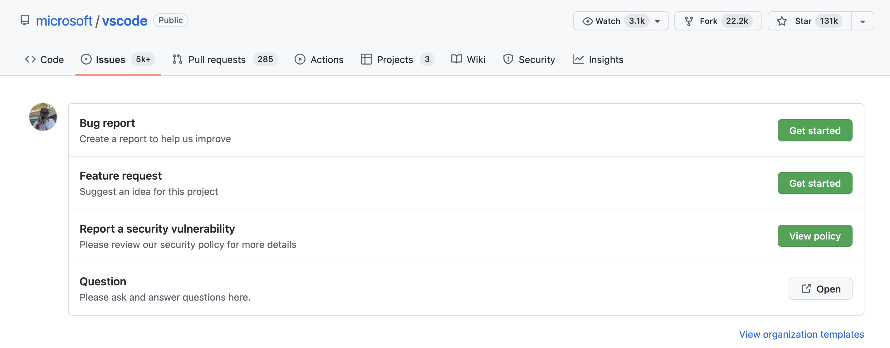
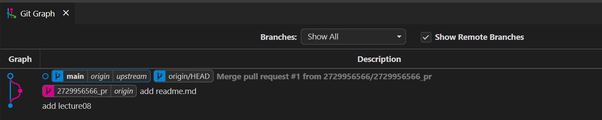
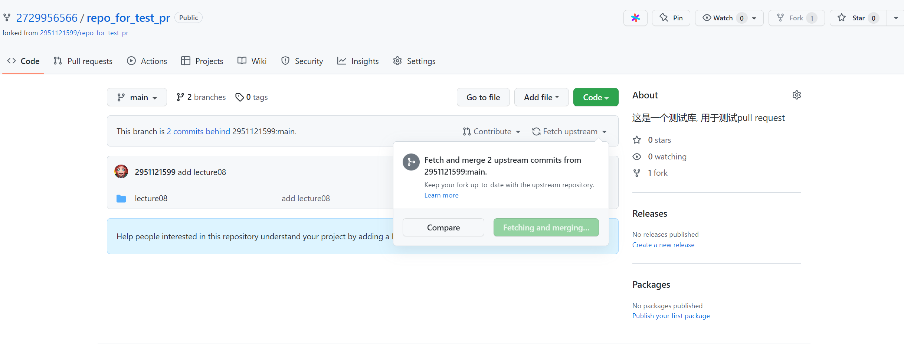

##  07_Github使用说明

[TOC]

### 7.1 仓库界面功能介绍


整个页面的信息量很大，我们主要介绍几个：

> 小问题：为什么要fork呢？为什么不直接push呢？
>
> fork方便了多人协作

**Watch**：Watch操作可以向你的邮箱中推送该仓库的推送信息，提示：如果不是特别重要的项目，不要随意点Watch，否则很容易邮箱被轰炸

**Issues**:Issues在Github官方文档中被翻译为议题，作用是针对仓库的内容进行讨论（例如bug反馈/新功能推荐），提示：Issues不等同于评论区，Issues板块应该专注于解决问题，不要在Issues中发一些和项目无关的内容

**Pull Requests**：Pull Requests，简称PR，是github中将修改过的代码分支合并到目标分支的操作。前面git的学习中，我们都知道commit是git的最小工作单元，在github的仓库中，PR是主要的工作单元。什么是拉取请求？在gitlab中，pr的操作叫做Merge Request， 实际上大家可以把PR理解为“我修改好了你的代码，现在请求你把代码拉回主仓库中”

**Action**：Github Action 是GitHub推出的自动化构建工具，感兴趣的同学可以阅读文档

**Projects**：针对某一仓库的项目看板

**Wiki**：  存放一些介绍性的内容

**Security**：与安全相关

**Insight**：里面包含里项目的一些数据，包括代码贡献的时间分布图，每个人的贡献量等

**discussion**：讨论区


### 7.2 提交issue

我们以vscode为例展示提交issue，进入Issues选项卡，可以看到vscode项目已经准备了一些模版。

提示：在提bug时，请尽可能详细的描述出bug发生的步骤以及所运行的环境  [最小可重现示例](https://stackoverflow.com/help/minimal-reproducible-example)。一般来说，Issue是参与项目贡献的起点，一个高质量的Issue也会让maintainer维护者更愿意交流、处理。




### 7.3 提交PR

如果你fork了一份项目代码并做了修改，并且希望将修改的代码合并进上游仓库中，就可以提交PR

注意：不是所有的PR都会被合并，所以在提交PR前请先和maintainer进行沟通，并且在开发的过程中反馈进度，一种比较好的方式就是draft（草案） PR。draft PR表示该PR还没有开发完，项目的maintainer不需要进行reveiw和merge，只需要简单看看代码是否符合预期。

小提示：在提交PR时，尽可能关联相关Issue，并说明你的代码解决了什么问题。

具体操作见下文。《如何提交PR以及更新fork项目》


### 7.4 探索Github

#### 7.4.1 Explore

点击GitHub最上方的Explore或输入https://github.com/explore 即可进入。Explore板块不仅可以根据你的兴趣进行项目的推荐，而且Trending榜展示了当前综合热度最高的项目。关注Trending可以随时掌握整个Github的最新动向

#### 7.4.2 快捷键

GitHub网站拥有一系列快捷键，你可以通过快捷键来完成你想要完成的动作，例如ctrl/command+k会调起一个类似于powertoy一样的搜索框，在这里你可以直接进行搜索。

类似的快捷键有很多，完整的快捷键见文档https://docs.github.com/cn/get-started/using-github/keyboard-shortcuts

#### 7.4.3 高级搜索

常见搜索的快速备忘单

##### 基本搜索

| 搜索                    | 使用...查找存储库                                |
| ----------------------- | ------------------------------------------------ |
| cat stars:>100          | 查找星数超过 100 的 cat 存储库。                 |
| user:2951121599         | 从用户 2951121599 获取所有存储库。               |
| qucik_sort extension:py | 在带有py扩展名的代码中查找所有qucik_sort的实例。 |
| NOT cat                 | 排除所有包含 cat 的结果。                        |


##### 存储库搜索

查看你在 GitHub 上可以访问的项目，你也可以过滤结果

| 搜索                     | 使用...查找存储库                          |
| ------------------------ | ------------------------------------------ |
| python forks:>200        | 查找所有大于 200 个forks的 Python 存储库。 |
| awesome-python fork:true | 包括 awesome-python 的分支。               |
| awesome-python fork:only | 仅返回 awesome-python 的分支。             |


##### 代码搜索

代码搜索会查看托管在 GitHub 上的文件。您还可以过滤结果：

| 搜索                        | 使用...查找存储库                                       |
| --------------------------- | ------------------------------------------------------- |
| chunk repo:2951121599/Utils | 从存储库 2951121599/Utils 中查找所有 chunk 的code实例。 |
| pandas user:2951121599      | 从所有公共 2951121599 存储库中查找对 pandas 的引用。    |
| examples path:/docs/        | 在路径 /docs/ 中查找所有examples 。                     |


##### 问题搜索

问题搜索查看 GitHub 上的 issues and pull requests（问题和拉取请求）。您还可以过滤结果：

| 搜索                 | 发现问题…                      |
| -------------------- | ------------------------------ |
| cat is:open          | 查找未解决的猫问题。           |
| strange comments:>42 | 超过 42 条评论的问题。         |
| hard label:bug       | 标记为错误的难题。             |
| author:2951121599    | 所有问题均由 2951121599 撰写。 |
| mentions:tpope       | 所有提到 tpope 的问题。        |
| assignee:2951121599  | 分配给 2951121599 的所有问题。 |


##### 用户搜索

用户搜索在 GitHub 上查找具有帐户的用户。您还可以过滤结果：

| 搜索                        | 使用...查找存储库                                  |
| --------------------------- | -------------------------------------------------- |
| fullname:"2951121599"       | 查找全名为“2951121599”的用户。                     |
| 2951121599 followers:1..100 | 查找关注者在 1 到 100 之间的所有 2951121599 用户。 |
| 2951121599 repos:>10        | 查找拥有超过 10 个存储库的 2951121599 用户。       |


#### 7.4.4 CodeSpace

在你的仓库界面，输入英文状态下的 `.`，即可进入该项目的web editor，这实质上是一个云端的vscode，方便用户查找编辑代码。


#### 7.4.5 Github API

Github对针对开发者提供了一系列API，详情见https://docs.github.com/en/developers 。通过API可以对数据采集分析，探索更微观的GitHub。也有开源项目专门做这件事情，例如open-digger开源项目（https://github.com/X-lab2017/open-digger ）


#### 7.4.6 Readme-profile

Readme-profile是github提供的一个主页展示仓库，用于修改自己的主页信息，具体实现方式为创建一个与自己用户名相同的仓库，该仓库可以展示在githubprofile中。同时，你也可以添加各种badges来让你的主页变得很炫酷。

一些可以参考的资源：

https://github.com/rzashakeri/beautify-github-profile

https://github.com/kautukkundan/Awesome-Profile-README-templates


### 7.5 如何提交PR?

1. fork仓库
2. 拉取最新代码到本地
3. 创建新分支
4. 修改后提交到远程仓库
5. 提交PR

eg：用户2951121599建立的仓库项目，用户2729956566对项目进行了提交PR操作（2729956566_pr），经过用户2951121599的审核通过后，就合并到了main主分支上去了。




### 7.6 更新fork的项目

情景：用户2729956566的对项目进行了fork，提交的PR通过了，或者项目进行了其它更新。此时，我们fork的项目已不是最新版，因此需要更新我们fork的项目到最新版。

大概步骤 [视频参考链接](https://www.bilibili.com/video/BV1Vb411A7z2?spm_id_from=333.337.search-card.all.click)

```shell
# 查看远程仓库有几个分支
git remote -v

# 将仓库的原始地址加进去
git remote add upstream git@github.com:2951121599/repo_for_test_pr.git

# 再次查看远程仓库的分支 (会多上有仓库upstream)
git remote -v

# fetch将远程分支拉到本地 pull = fetch + merge (pull会做自动合并)
# 创建新分支 master/upstream
git fetch upstream

# 查看远程分支 若跟本地分支名一样 然后做一下合并
git branch -r

# 和原始仓库的远程保持一致 rebase不会做合并操作,将当前分支的修改复制并放在目标分支的最后一次 而merge会将两个分支合在一起
# 因此没做贡献用rebase就够了
git rebase upstream/master

# 推送
git push
```


Fetch upstream




### 7.7 案例：angular提交PR要求 

#### 拉取请求准则

在提交拉取请求 (PR) 之前，请考虑以下准则：

1. 在GitHub中搜索与您的提交相关的开放或封闭 PR。您不想重复现有的工作。

2. 确保问题描述了您正在修复的问题，或记录了您要添加的功能的设计。提前讨论设计有助于确保我们准备好接受您的工作。

3. 请在发送 PR 之前

4. [fork-a-repo](https://docs.github.com/en/github/getting-started-with-github/fork-a-repo)

5. 在你fork的repo中, 在一个新的git branch中做出一些改变。

   ```shell
   git checkout -b my-fix-branch main
   ```

6. 创建你的补丁，**包括适当的测试用例**。

7. 遵循我们的[编码规则](https://github.com/angular/angular/blob/main/CONTRIBUTING.md#rules)。

8. 运行完整的测试, 并确保所有测试都通过。

9. 使用遵循我们的[提交消息约定](https://github.com/angular/angular/blob/main/CONTRIBUTING.md#commit)的描述性提交消息提交您的更改。必须遵守这些约定，因为发行说明是从这些消息中自动生成的。

   ```shell
   git commit --all
   ```

   注意：可选的提交`-a`命令行选项会自动 "add" 和 "rm" 编辑过的文件。

10. 将您的分支推送到 GitHub：

    ```shell
    git push origin my-fix-branch
    ```

11. 在 GitHub 中，向`angular:main`发送一个pull request

#### 审查拉取请求

#### 处理审查反馈

如果我们要求通过代码审查进行更改，那么：

1. 对代码进行必要的更新。

2. 重新运行测试套件以确保测试仍然通过。

3. 创建一个修复提交并推送到您的 GitHub 存储库（这将更新您的拉取请求）

#### 更新提交消息

审阅者可能经常建议对提交消息进行更改（例如，为更改添加更多上下文）。为了更新分支上最后一次提交的提交消息：

1. 查看您的分支：

   ```shell
   git checkout my-fix-branch
   ```

2. 修改最后一次提交并修改提交信息：

   ```shell
   git commit --amend
   ```

3. 推送到您的 GitHub 存储库：

   ```shell
   git push --force-with-lease
   ```

> 注意：如果您需要更新较早提交的提交消息，您可以`git rebase`在交互模式下使用。

#### 拉取请求被合并后

拉取请求被合并后，您可以安全地删除分支并从主（上游）存储库中拉取更改：

- 通过 GitHub Web UI 或本地 shell 删除 GitHub 上的远程分支：

  ```shell
  git push origin --delete my-fix-branch
  ```

- 查看主分支：

  ```shell
  git checkout main -f
  ```

- 删除本地分支：

  ```shell
  git branch -D my-fix-branch
  ```

- `main`使用最新的上游版本更新您的本地：

  ```shell
  git pull --ff upstream main
  ```

