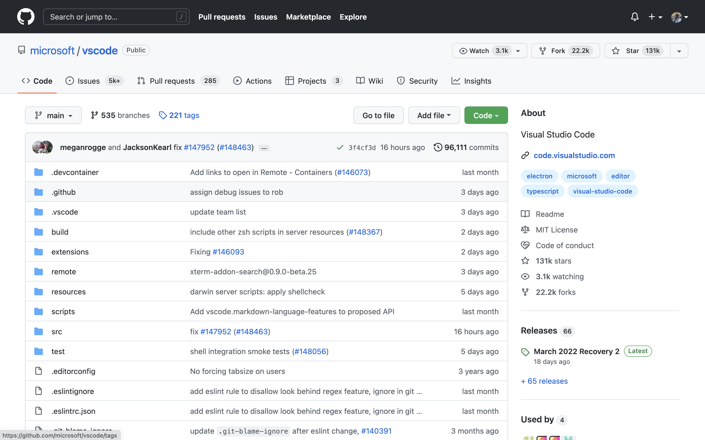
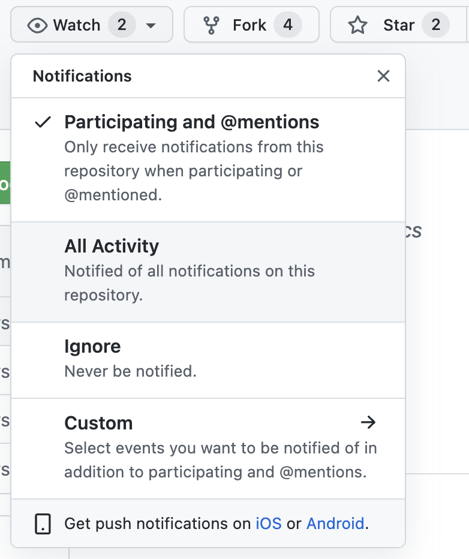
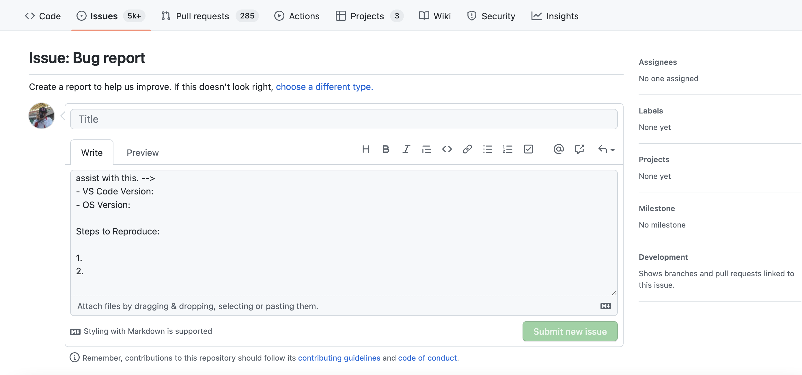
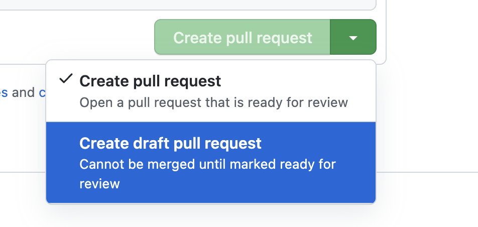
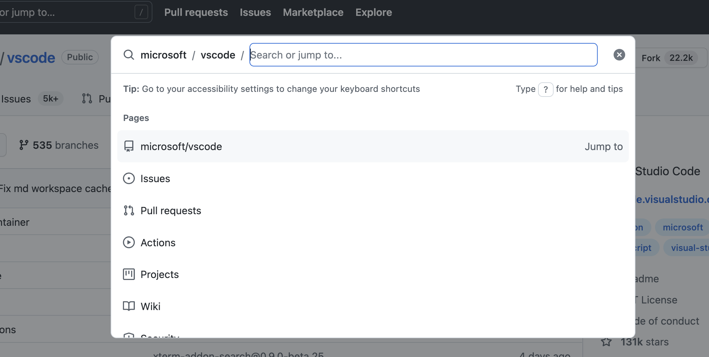
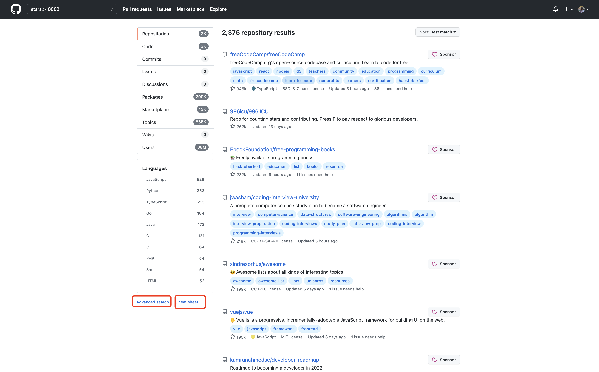

#  07_Github/Gitee使用说明


## 8.1 仓库界面功能介绍




整个页面的信息量很大，我们主要介绍几个：

> 小问题：为什么要fork呢？为什么不直接push呢？
>
> fork方便了多人协作

**Watch**：Watch操作可以向你的邮箱中推送该仓库的推送信息，提示：如果不是特别重要的项目，不要随意点Watch，否则很容易邮箱被轰炸




**Issues**:Issues在Github官方文档中被翻译为议题，作用是针对仓库的内容进行讨论（例如bug反馈/新功能推荐），提示：Issues不等同于评论区，Issues板块应该专注于解决问题，不要在Issues中发一些和项目无关的内容

**Pull Requests**：Pull Requests，简称PR，是github中将修改过的代码分支合并到目标分支的操作。前面git的学习中，我们都知道commit是git的最小工作单元，在github的仓库中，PR是主要的工作单元。

什么是拉取请求？在gitlab中，pr的操作叫做Merge Request， 实际上大家可以把PR理解为“我修改好了你的代码，现在请求你把代码拉回主仓库中”

**Action**：Github Action 是GitHub推出的自动化构建工具，感兴趣的同学可以阅读文档

**Projects**：针对某一仓库的项目看板

**Wiki**：  存放一些介绍性的内容

**Security**：与安全相关

**Insight**：里面包含里项目的一些数据，包括代码贡献的时间分布图，每个人的贡献量等

**discussion**：讨论区


## 8.2 提交issue

我们以vscode为例展示提交issue


进入Issues选项卡，可以看到vscode项目已经准备了一些模版，我们点击Bug report




> 提示：在提bug时，请尽可能详细的描述出bug发生的步骤以及所运行的环境（https://stackoverflow.com/help/minimal-reproducible-example ）。一般来说，Issue是参与项目贡献的起点，一个高质量的Issue也会让maintainer维护者更愿意交流、处理。


## 8.3 提交PR

如果你fork了一份项目代码并做了修改，并且希望将修改的代码合并进上游仓库中，就可以提交PR

注意：不是所有的PR都会被合并，所以在提交PR前请先和maintainer进行沟通，并且在开发的过程中反馈进度，一种比较好的方式就是draft（草案） PR，如下图所示：



draft PR表示该PR还没有开发完，项目的maintainer不需要进行reveiw和merge，只需要简单看看代码是否符合预期。

小提示：在提交PR时，尽可能关联相关Issue，并说明你的代码解决了什么问题。


## 8.4 探索Github


1. GitHub Explore

点击GitHub最上方的Explore或输入https://github.com/explore 即可进入。Explore板块不仅可以根据你的兴趣进行项目的推荐，而且Trending榜展示了当前综合热度最高的项目。关注Trending可以随时掌握整个Github的最新动向

2.  GitHub 快捷键

GitHub网站拥有一系列快捷键，你可以通过快捷键来完成你想要完成的动作，例如ctrl/command+k会调起一个类似于powertoy一样的搜索框，在这里你可以直接进行搜索。



类似的快捷键有很多，完整的快捷键见文档https://docs.github.com/cn/get-started/using-github/keyboard-shortcuts

3. 高级搜索

高效的搜索方式可以节约你很多时间，例如下面代码可以帮助你找到Github中star量超过10000的项目

```
stars:>10000
```



常见搜索的快速备忘单

## 基本搜索

| 搜索                    | 使用...查找存储库                                |
| ----------------------- | ------------------------------------------------ |
| cat stars:>100          | 查找星数超过 100 的 cat 存储库。                 |
| user:2951121599         | 从用户 2951121599 获取所有存储库。               |
| qucik_sort extension:py | 在带有py扩展名的代码中查找所有qucik_sort的实例。 |
| NOT cat                 | 排除所有包含 cat 的结果。                        |

## 存储库搜索

查看你在 GitHub 上可以访问的项目，你也可以过滤结果

| This search              | Finds repositories with…                   |
| ------------------------ | ------------------------------------------ |
| python forks:>200        | 查找所有大于 200 个forks的 Python 存储库。 |
| awesome-python fork:true | 包括 awesome-python 的分支。               |
| awesome-python fork:only | 仅返回 awesome-python 的分支。             |

## 代码搜索

代码搜索会查看托管在 GitHub 上的文件。您还可以过滤结果：

| This search                 | Finds repositories with…                                |
| --------------------------- | ------------------------------------------------------- |
| chunk repo:2951121599/Utils | 从存储库 2951121599/Utils 中查找所有 chunk 的code实例。 |
| pandas user:2951121599      | 从所有公共 2951121599 存储库中查找对 pandas 的引用。    |
| examples path:/docs/        | 在路径 /docs/ 中查找所有examples 。                     |

## 问题搜索

问题搜索查看 GitHub 上的 issues and pull requests（问题和拉取请求）。您还可以过滤结果：

| 这个搜索             | 发现问题…                      |
| -------------------- | ------------------------------ |
| cat is:open          | 查找未解决的猫问题。           |
| strange comments:>42 | 超过 42 条评论的问题。         |
| hard label:bug       | 标记为错误的难题。             |
| author:2951121599    | 所有问题均由 2951121599 撰写。 |
| mentions:tpope       | 所有提到 tpope 的问题。        |
| assignee:2951121599  | 分配给 2951121599 的所有问题。 |

## 用户搜索

用户搜索在 GitHub 上查找具有帐户的用户。您还可以过滤结果：

| 这个搜索                    | 使用...查找存储库                                  |
| --------------------------- | -------------------------------------------------- |
| fullname:"2951121599"       | 查找全名为“2951121599”的用户。                     |
| 2951121599 followers:1..100 | 查找关注者在 1 到 100 之间的所有 2951121599 用户。 |
| 2951121599 repos:>10        | 查找拥有超过 10 个存储库的 2951121599 用户。       |


5. 内置IDE --- CodeSpace

在你的仓库界面，输入英文状态下的 `.`，即可进入该项目的web editor，这实质上是一个云端的vscode，方便用户查找编辑代码。

7. 用数据探索GitHub--Github API

Github对针对开发者提供了一系列API，详情见https://docs.github.com/en/developers 。通过API可以对数据采集分析，探索更微观的GitHub。也有开源项目专门做这件事情，例如open-digger开源项目（https://github.com/X-lab2017/open-digger ）


>  **练习一**（选做）：github readme-profile练习
>
>  Readme-profile是github提供的一个主页展示仓库，具体实现方式为创建一个与自己用户名相同的仓库，该仓库可以展示在githubprofile中。同时，你也可以添加各种badges来让你的主页变得很炫酷。
>
>  一些可以参考的资源：
>
>  https://github.com/rzashakeri/beautify-github-profile
>
>  https://github.com/kautukkundan/Awesome-Profile-README-templates

> **练习二**（选做）：小组内PR练习
>
> 以小组为单位建立学习一个仓库，每人向仓库中提交pr并合并到主分支中。


## 8.5 国内其他代码托管平台简介

Gitee/Coding/jihulab

----

补充资料一：一些Git相关的开源仓库

Progit2:https://github.com/progit/progit2

git-cheat-sheet:https://github.com/arslanbilal/git-cheat-sheet

githug--一个ruby编写的git练习游戏:https://github.com/Gazler/githug

gitignore模版：https://github.com/github/gitignore

git-extras：https://github.com/tj/git-extras

git-recipes：https://github.com/geeeeeeeeek/git-recipes


补充资料二：GitHub高赞项目推荐

awesome系列：

主仓库https://github.com/sindresorhus/awesome

周刊系列：

https://github.com/GrowingGit/GitHub-Chinese-Top-Charts

https://github.com/ruanyf/weekly

https://github.com/GitHubDaily/GitHubDaily

资源集合系列：

https://github.com/papers-we-love/papers-we-love

https://github.com/public-apis/public-apis

https://github.com/danistefanovic/build-your-own-x

https://github.com/GorvGoyl/Clone-Wars

https://github.com/TheAlgorithms


