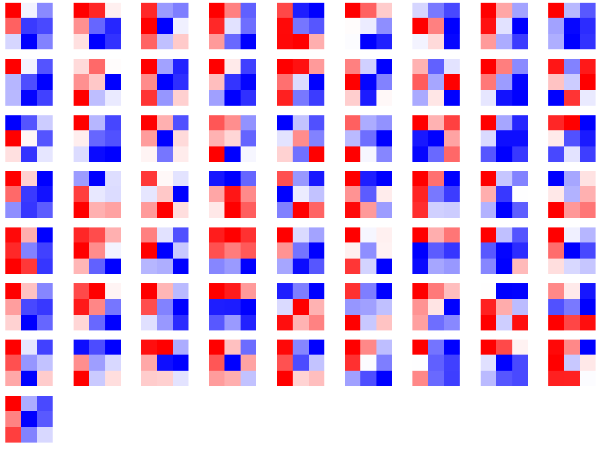
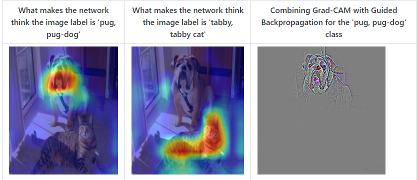

## Pytorch可视化学习

### 1. 打印模型基础信息

```python
# 使用print函数
import torchvision.models as models

# vgg13
model = models.vgg13()
print(model)
```


这时候得到模型信息输出结果只能得出基础构件的信息，既不能显示出**每一层的shape**，也不能显示**对应参数量的大小**。

```python
VGG(
  (features): Sequential(
    (0): Conv2d(3, 64, kernel_size=(3, 3), stride=(1, 1), padding=(1, 1))
    (1): ReLU(inplace=True)
    (2): Conv2d(64, 64, kernel_size=(3, 3), stride=(1, 1), padding=(1, 1))
    (3): ReLU(inplace=True)
    (4): MaxPool2d(kernel_size=2, stride=2, padding=0, dilation=1, ceil_mode=False)
    (5): Conv2d(64, 128, kernel_size=(3, 3), stride=(1, 1), padding=(1, 1))
    (6): ReLU(inplace=True)
    (7): Conv2d(128, 128, kernel_size=(3, 3), stride=(1, 1), padding=(1, 1))
    (8): ReLU(inplace=True)
    (9): MaxPool2d(kernel_size=2, stride=2, padding=0, dilation=1, ceil_mode=False)
    (10): Conv2d(128, 256, kernel_size=(3, 3), stride=(1, 1), padding=(1, 1))
    (11): ReLU(inplace=True)
    (12): Conv2d(256, 256, kernel_size=(3, 3), stride=(1, 1), padding=(1, 1))
    (13): ReLU(inplace=True)
    (14): MaxPool2d(kernel_size=2, stride=2, padding=0, dilation=1, ceil_mode=False)
    (15): Conv2d(256, 512, kernel_size=(3, 3), stride=(1, 1), padding=(1, 1))
    (16): ReLU(inplace=True)
    (17): Conv2d(512, 512, kernel_size=(3, 3), stride=(1, 1), padding=(1, 1))
    (18): ReLU(inplace=True)
    (19): MaxPool2d(kernel_size=2, stride=2, padding=0, dilation=1, ceil_mode=False)
    (20): Conv2d(512, 512, kernel_size=(3, 3), stride=(1, 1), padding=(1, 1))
    (21): ReLU(inplace=True)
    (22): Conv2d(512, 512, kernel_size=(3, 3), stride=(1, 1), padding=(1, 1))
    (23): ReLU(inplace=True)
    (24): MaxPool2d(kernel_size=2, stride=2, padding=0, dilation=1, ceil_mode=False)
  )
  (avgpool): AdaptiveAvgPool2d(output_size=(7, 7))
  (classifier): Sequential(
    (0): Linear(in_features=25088, out_features=4096, bias=True)
    (1): ReLU(inplace=True)
    (2): Dropout(p=0.5, inplace=False)
    (3): Linear(in_features=4096, out_features=4096, bias=True)
    (4): ReLU(inplace=True)
    (5): Dropout(p=0.5, inplace=False)
    (6): Linear(in_features=4096, out_features=1000, bias=True)
  )
)
```

### 2. 可视化网络结构

​	使用torchinfo工具包来可视化网络结构

#### 2.1 torchinfo的安装

- pip安装: ``pip install torchinfo``

- conda安装: ``conda install -c conda-forge torchinfo``

#### 2.2 torchinfo的使用

- 使用torchinfo.summary()就行了，必需的参数分别是model，input_size[batch_size, channel, h, w]

- torchinfo提供了更加详细的信息，包括**模块信息**（每一层的**类型**、**输出shape**和**参数量**）、**模型整体的参数量**、**模型大小**、一次前向或者反向传播需要的内存大小等

```python
import torchvision.models as models
from torchinfo import summary

vgg13 = models.vgg13()  # 实例化模型
summary(vgg13, (1, 3, 224, 224))  # 1：batch_size 3:图片的通道数 224: 图片的高宽
```

输出信息

```python
==========================================================================================
Layer (type:depth-idx)                   Output Shape              Param #
==========================================================================================
VGG                                      --                        --
├─Sequential: 1-1                        [1, 512, 7, 7]            --
│    └─Conv2d: 2-1                       [1, 64, 224, 224]         1,792
│    └─ReLU: 2-2                         [1, 64, 224, 224]         --
│    └─Conv2d: 2-3                       [1, 64, 224, 224]         36,928
│    └─ReLU: 2-4                         [1, 64, 224, 224]         --
│    └─MaxPool2d: 2-5                    [1, 64, 112, 112]         --
│    └─Conv2d: 2-6                       [1, 128, 112, 112]        73,856
│    └─ReLU: 2-7                         [1, 128, 112, 112]        --
│    └─Conv2d: 2-8                       [1, 128, 112, 112]        147,584
│    └─ReLU: 2-9                         [1, 128, 112, 112]        --
│    └─MaxPool2d: 2-10                   [1, 128, 56, 56]          --
│    └─Conv2d: 2-11                      [1, 256, 56, 56]          295,168
│    └─ReLU: 2-12                        [1, 256, 56, 56]          --
│    └─Conv2d: 2-13                      [1, 256, 56, 56]          590,080
│    └─ReLU: 2-14                        [1, 256, 56, 56]          --
│    └─MaxPool2d: 2-15                   [1, 256, 28, 28]          --
│    └─Conv2d: 2-16                      [1, 512, 28, 28]          1,180,160
│    └─ReLU: 2-17                        [1, 512, 28, 28]          --
│    └─Conv2d: 2-18                      [1, 512, 28, 28]          2,359,808
│    └─ReLU: 2-19                        [1, 512, 28, 28]          --
│    └─MaxPool2d: 2-20                   [1, 512, 14, 14]          --
│    └─Conv2d: 2-21                      [1, 512, 14, 14]          2,359,808
│    └─ReLU: 2-22                        [1, 512, 14, 14]          --
│    └─Conv2d: 2-23                      [1, 512, 14, 14]          2,359,808
│    └─ReLU: 2-24                        [1, 512, 14, 14]          --
│    └─MaxPool2d: 2-25                   [1, 512, 7, 7]            --
├─AdaptiveAvgPool2d: 1-2                 [1, 512, 7, 7]            --
├─Sequential: 1-3                        [1, 1000]                 --
│    └─Linear: 2-26                      [1, 4096]                 102,764,544
│    └─ReLU: 2-27                        [1, 4096]                 --
│    └─Dropout: 2-28                     [1, 4096]                 --
│    └─Linear: 2-29                      [1, 4096]                 16,781,312
│    └─ReLU: 2-30                        [1, 4096]                 --
│    └─Dropout: 2-31                     [1, 4096]                 --
│    └─Linear: 2-32                      [1, 1000]                 4,097,000
==========================================================================================
Total params: 133,047,848
Trainable params: 133,047,848
Non-trainable params: 0
Total mult-adds (G): 11.32
==========================================================================================
Input size (MB): 0.60
Forward/backward pass size (MB): 98.02
Params size (MB): 532.19
Estimated Total Size (MB): 630.81
==========================================================================================
```

注意点:

> 当你使用的是colab或者jupyter notebook时，想要实现该方法，`summary()`一定是该单元（即notebook中的cell）的返回值，否则我们就需要使用`print(summary(...))`来可视化。

### 3. CNN可视化

卷积神经网络（CNN）是深度学习中非常重要的模型结构，它广泛地用于图像处理，极大地提升了模型表现，推动了计算机视觉的发展和进步。但CNN是一个“黑盒模型”，人们并不知道CNN是如何获得较好表现的，由此带来了深度学习的可解释性问题。如果能理解CNN工作的方式，人们不仅能够解释所获得的结果，**提升模型的鲁棒性**，而且还能有针对性地改进CNN的结构以获得进一步的效果提升。

理解CNN的重要一步是可视化，包括**可视化特征是如何提取的**、**提取到的特征的形式**以及**模型在输入数据上的关注点**等。从上述三个方面介绍如何在PyTorch的框架下完成CNN模型的可视化。包括：

- 可视化CNN**卷积核**的方法
- 可视化CNN**特征图**的方法
- 可视化CNN**显著图**的方法

#### 3.1 CNN卷积核可视化

卷积核在CNN中负责提取特征，可视化卷积核能够帮助人们理解CNN各个层在提取什么样的特征，进而理解模型的工作原理。
靠近输入的层提取的特征是相对简单的结构，而靠近输出的层提取的特征就和图的实体形状相近了

在``PyTorch``中，**可视化卷积核就等价于可视化对应的权重矩阵**

##### VGG11模型卷积核可视化

首先加载模型，并确定模型的层信息：

```python
import torch
from torchvision.models import vgg11

model = vgg11(pretrained=True)
print(dict(model.features.named_children()))
```

```python
{'0': Conv2d(3, 64, kernel_size=(3, 3), stride=(1, 1), padding=(1, 1)),
 '1': ReLU(inplace=True),
 '2': MaxPool2d(kernel_size=2, stride=2, padding=0, dilation=1, ceil_mode=False),
 '3': Conv2d(64, 128, kernel_size=(3, 3), stride=(1, 1), padding=(1, 1)),
 '4': ReLU(inplace=True),
 '5': MaxPool2d(kernel_size=2, stride=2, padding=0, dilation=1, ceil_mode=False),
 '6': Conv2d(128, 256, kernel_size=(3, 3), stride=(1, 1), padding=(1, 1)),
 '7': ReLU(inplace=True),
 '8': Conv2d(256, 256, kernel_size=(3, 3), stride=(1, 1), padding=(1, 1)),
 '9': ReLU(inplace=True),
 '10': MaxPool2d(kernel_size=2, stride=2, padding=0, dilation=1, ceil_mode=False),
 '11': Conv2d(256, 512, kernel_size=(3, 3), stride=(1, 1), padding=(1, 1)),
 '12': ReLU(inplace=True),
 '13': Conv2d(512, 512, kernel_size=(3, 3), stride=(1, 1), padding=(1, 1)),
 '14': ReLU(inplace=True),
 '15': MaxPool2d(kernel_size=2, stride=2, padding=0, dilation=1, ceil_mode=False),
 '16': Conv2d(512, 512, kernel_size=(3, 3), stride=(1, 1), padding=(1, 1)),
 '17': ReLU(inplace=True),
 '18': Conv2d(512, 512, kernel_size=(3, 3), stride=(1, 1), padding=(1, 1)),
 '19': ReLU(inplace=True),
 '20': MaxPool2d(kernel_size=2, stride=2, padding=0, dilation=1, ceil_mode=False)}
```


卷积核对应的应为卷积层（Conv2d），这里以第3层为例，可视化对应的参数：

```python
conv1 = dict(model.features.named_children())['3']
kernel_set = conv1.weight.detach()
num = len(conv1.weight.detach())
print(kernel_set.shape)
for i in range(0,num):
    i_kernel = kernel_set[i]
    plt.figure(figsize=(20, 17))
    if (len(i_kernel)) > 1:
        for idx, filer in enumerate(i_kernel):
            plt.subplot(9, 9, idx+1) 
            plt.axis('off')
            plt.imshow(filer[ :, :].detach(),cmap='bwr')
```

```python
torch.Size([128, 64, 3, 3])
```

由于第3层的特征图由64维变为128维，因此共有128*64个卷积核，其中部分卷积核可视化效果如下图所示：



#### 3.2 CNN特征图可视化方法

与卷积核相对应，输入的原始图像经过**每次卷积层得到的数据称为特征图**

**可视化卷积核是为了看模型提取哪些特征**

**可视化特征图则是为了看模型提取到的特征是什么样子的**

获取特征图的方法有很多种，可以从输入开始，逐层做前向传播，直到想要的特征图处将其返回。尽管这种方法可行，但是有些麻烦了。在PyTorch中，提供了一个专用的接口使得网络在前向传播过程中能够获取到特征图，这个接口的名称非常形象，叫做**hook**。可以想象这样的场景，数据通过网络向前传播，网络某一层我们预先设置了一个钩子，数据传播过后钩子上会留下数据在这一层的样子，读取钩子的信息就是这一层的特征图。具体实现如下：

```python
import matplotlib.pyplot as plt


class Hook(object):
    def __init__(self):
        self.module_name = []
        self.features_in_hook = []
        self.features_out_hook = []

    def __call__(self, module, fea_in, fea_out):
        print("hooker working", self)
        self.module_name.append(module.__class__)
        self.features_in_hook.append(fea_in)
        self.features_out_hook.append(fea_out)
        return None


def plot_feature(model, idx, inputs):
    hh = Hook()
    model.features[idx].register_forward_hook(hh)

    # forward_model(model,False)
    model.eval()
    _ = model(inputs)
    print(hh.module_name)
    print(hh.features_in_hook[0][0].shape)
    print(hh.features_out_hook[0].shape)

    out1 = hh.features_out_hook[0]

    total_ft = out1.shape[1]
    first_item = out1[0].cpu().clone()

    plt.figure(figsize=(20, 17))

    for ftidx in range(total_ft):
        if ftidx > 99:
            break
        ft = first_item[ftidx]
        plt.subplot(10, 10, ftidx + 1)

        plt.axis('off')
        # plt.imshow(ft[ :, :].detach(),cmap='gray')
        plt.imshow(ft[:, :].detach())
```


这里我们首先实现了一个hook类，之后在plot_feature函数中，将该hook类的对象注册到要进行可视化的网络的某层中。model在进行前向传播的时候会调用hook的__call__函数，我们也就是在那里存储了当前层的输入和输出。这里的features_out_hook 是一个list，每次前向传播一次，都是调用一次，也就是features_out_hook 长度会增加1

#### 3.3 CNN显著图可视化方法

显著图 class activation map （CAM）的作用是判断哪些变量对模型来说是重要的，在CNN可视化的场景下，即判断图像中哪些像素点对预测结果是重要的。除了确定重要的像素点，人们也会对重要区域的梯度感兴趣，因此在CAM的基础上也进一步改进得到了Grad-CAM（以及诸多变种）。CAM和Grad-CAM的示例如下图所示：



相比可视化卷积核与可视化特征图，CAM系列可视化更为直观，能够一目了然地确定重要区域，进而进行可解释性分析或模型优化改进。CAM系列操作的实现可以通过开源工具包pytorch-grad-cam来实现。

安装 ``pip install grad-cam``

#### 3.4 使用FlashTorch快速实现CNN可视化

安装
``pip install flashtorch``

- 可视化梯度

- 可视化卷积核