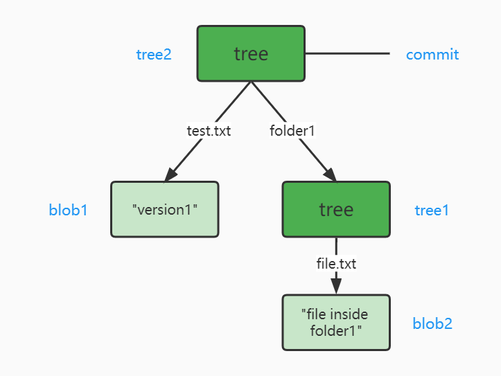

# 05\_Git 内部原理

\[TOC]

[参考链接：git 内部原理](https://blog.csdn.net/canpool/article/details/120499614)

## 5.1 .git 的目录结构

config: 记录与本项目相关的配置信息 description: 是GitWeb项目对于本仓库的基本描述 HEAD: 内部记录了当前分支的最后一次提交（默认指向refs/heads/master文件） hooks: 记录客户端和服务端的脚本，完成相关的自动化工作（钩子脚本的目的） info: 记录全局的文件忽略方式，用于标记不被git仓库跟踪的文件，与.gitignore类似 objects: 是git仓库的关键，归档所有git数据库里的内容 refs: 也是git仓库主要内容，记录所有分支的提交对象（commit object）

```
├── *config               配置信息(比如本地repo是否大小写敏感, remote端repo的url, 用户名邮箱等) 
├── description           无需关心（仅供GitWeb程序使用）
├── *HEAD                 目前被检出的分支
├── index                 保存暂存区信息
│
│
├── hooks/                钩子脚本（执行Git命令时自动执行一些特定操作）
├── info/                 包含一个全局性排除文件
│   └── exclude           放置不希望被记录在 .gitignore 文件中的忽略模式
├── logs/                 记录所有操作
├── *objects/             存储所有数据内容
│   ├── SHA-1/            保存git对象的目录（三类对象commit, tree和blob）
│   ├── info/
│   └── pack/             
└── *refs/                存储指向数据（分支、远程仓库和标签等）的提交对象的指针
    ├── heads/           
    ├── remotes/         
    └── tags/            
```

## 5.2 config文件

#### 5.2.1 引用规范

引用规范的格式由一个可选的 + 号和紧随其后的 : 组成， 其中 是一个模式（pattern），代表远程版本库中的引用； 是本地跟踪的远程引用的位置。 + 号告诉 Git 即使在不能快进的情况下也要（强制）更新引用。

默认情况下，引用规范由 `git remote add origin` 命令自动生成， Git 获取服务器中 refs/heads/ 下面的所有引用，并将它写入到本地的 refs/remotes/origin/ 中。

一些常用命令：

| 说明                           | 命令                                      |
| ---------------------------- | --------------------------------------- |
| 连接远程仓库                       | `git remote add <远端名origin> <url>`      |
| 拉取分支                         | `git fetch <远端名origin> <远端分支名>:<本地分支名>` |
| 将远程的 main 分支拉到本地的mymaster 分支 | `git fetch origin main:mymaster`        |
| 将本地的master分支推送到远端的topic分支    | `git push origin master:topic`          |
| 删除远端分支topic                  | `git push origin --delete topic`        |

#### 5.2.2 环境变量

Git有三种环境变量：

（1）系统变量

* 适用范围：对所有用户都适用
* 命令选项：`git config --system`

（2）用户变量

* 适用范围：只适用于该用户
* 命令选项：`git config --global`

（3）本地项目变量

* 适用范围：只对当前项目有效
* 命令选项：`git config --local`
* 存储位置：`.git/config`

一些常用命令：

| 说明     | 命令                                      |
| ------ | --------------------------------------- |
| 查看所有配置 | `git config --list`                     |
| 配置用户名  | `git config --global user.name "你的用户名"` |
| 配置邮箱   | `git config --global user.email "你的邮箱"` |

## 5.3 objects目录

#### 5.3.1 对象存储

Git 的核心部分是一个简单的键值对数据库

初始化仓库后：objects目录下只有子目录 `pack` 和 `info` ，但均为空。

运行以下命令，创建两个文件并提交

```shell
# 创建了 blob1
echo "version1" > test.txt
git add .

# 创建了 blob2
mkdir folder1
echo "file inside folder1" >folder1/file.txt
git add .

# 创建了 tree1, tree2和commit
git commit -m "test"
[master (root-commit) 67f0856] test
 2 files changed, 2 insertions(+)
 create mode 100644 folder1/file.txt
 create mode 100644 test.txt
```

此时查看objects目录，会发现新增了5个子目录。

```
.git/objects
├── 40
│   └── fa006a9f641b977fc7b3b5accb0171993a3d31
├── 5b
│   └── dcfc19f119febc749eef9a9551bc335cb965e2
├── 67
│   └── f0856ccd04627766ca251e5156eb391a4a4ff8
├── 87
│   └── db2fdb5f60f9a453830eb2ec3cf50fea3782a6
├── ac
│   └── f63c316ad27e8320a23da194e61f45be040b0b
├── info
└── pack
```

**(1) 对象的定义**

objects目录下存储三种对象：数据对象（blob），树对象（tree）和提交对象（commit）。

5个子目录的含义如下图所示：2个blob, 2个tree和1个commit



**(2) 如何存储对象**

*   Git会根据对象内容生成一个 SHA-1 哈希值（称为该文件的校验和）

    例如：`40fa006a9f641b977fc7b3b5accb0171993a3d31`
*   截取校验和的前两个字符 => 用于命名子目录

    例如：`40`
*   校验和余下的 38 个字符 => 用于文件名

    例如：`fa006a9f641b977fc7b3b5accb0171993a3d31`
* 将对象内容存储在 `子目录/文件名` 内

**(3) 查看存储对象内容**

可以根据校验和，查看存储的内容及对象类型

```shell
# 查看文件类型
git cat-file -t 40fa006a9f641b977fc7b3b5accb0171993a3d31
blob

# 查看文件内容
git cat-file -p 40fa006a9f641b977fc7b3b5accb0171993a3d31
file inside folder1
```

#### 5.3.2 包文件的存储机制

> Git默认保存文件快照，即保存每个文件每个版本的完整内容。但假设只更改了某大文件中的一个字符，保存两次全部内容是不是有点低效？

Git最初向磁盘存储对象时采用"松散"对象格式；但为了节省空间和提高效率，Git会时不时将多个对象打包成一个称为"包文件"。

当版本库中有太多的"松散"对象，或者手动执行 `git gc` 命令，或者向远程服务器执行推送时，Git 都会进行打包。

此时查看objects目录，会发现很多子目录不见了，而 `info` 和 `pack` 目录非空。

```
.git/objects
├── info
│   ├── commit-graph
│   └── packs
└──  pack
    ├── pack-XXX.idx
    └── pack-XXX.pack
```

* 包文件`pack-XXX.pack`：包含了刚才从文件系统中移除的所有对象的内容
* 索引文件`pack-XXX.idx`：包含了包文件的偏移信息。通过索引文件可以快速定位任意一个指定对象

## 5.4 refs目录

Git把一些常用的 `SHA-1` 值存储在文件中，用文件名来替代，这些别名就称为**引用**（references，或简写为 refs）

有三种引用类型：heads, remotes和tags

```shell
# 基于当前commit创建新分支test
git branch test

# 基于commit打tag
git tag -a v1.0 <commitId>

# 连接远程仓库
git remote add origin 远程仓库地址
git fetch

# 本地修改文件，然后运行git stash
echo "version2" > test.txt
git stash
```

此时查看refs目录，内容如下

```shell
.git/refs
├── heads         # 记录本地分支的最后一次提交
│   ├── master
│   └── test
├── remotes       # 记录远程仓库各分支的最后一次提交
│   └── origin
│         └── main
├── tags
│   └── v1.0
└── stash
```

### 5.4.1 HEAD引用

HEAD 文件通常是一个符号引用（symbolic reference），指向目前所在的分支。 所谓符号引用，表示它是一个指向其他引用的指针。

HEAD引用有两种类型

|       | 存储位置                 |                  指代内容                 | 文件内容                               |
| ----- | -------------------- | :-----------------------------------: | ---------------------------------- |
| 分支级别  | `.git/refs/heads`目录下 | 本地分支的最后一次提交：**有多少个分支，就有多少个同名的HEAD引用** | commitHash                         |
| 代码库级别 | `.git/HEAD`文件        |              指代当前代码所处的分支              | 符号引用 - 例如 `ref: refs/heads/master` |

### 5.4.2 远程引用

* 存储位置： `.git/refs/remotes` 目录下
* 指代内容：远程仓库各分支的最后一次提交
* 注意点：用于记录远程仓库

### 5.4.3 标签引用

> tag主要用于发布版本的管理：一个版本发布之后，我们可以为git打上 v1.0 v2.0 ... 这样的标签

* 存储位置：`.git/refs/heads` 目录下
* 指代内容：tag可以指向任何类型（更多的是指向一个commit，赋予它一个更友好的名字）
* 文件内容：SHA-1值

### 5.4.4 stash

* 存储位置：`.git/refs/stash` 文件
* 指代内容：当你想转到其他分支进行其他工作，又不想舍弃当前修改的代码时 - stash可把当前的修改暂存起来
